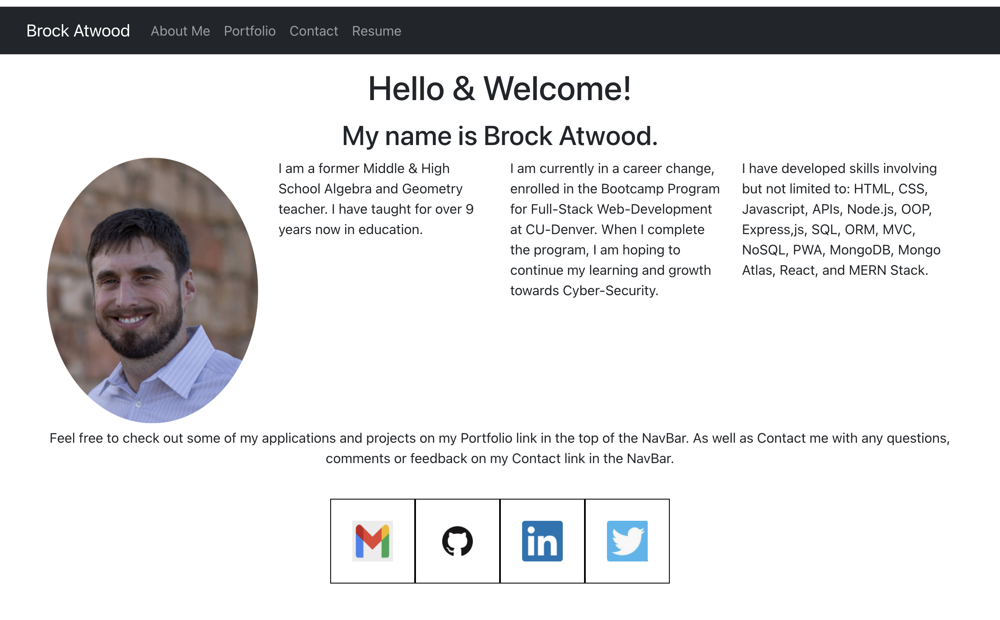

# Brock Atwood React-Portfolio

## Description

This Application was created using React to help set Devs apart from others whom do not use the latest technologies.

## Getting Started

You’ll use `create-react-app` to build your portfolio, which will include the following:

- A single `Header` component that appears on multiple pages

- A single `Navigation` component within the header that will be used to conditionally render the different sections of your portfolio

- A single `Project` component that will be used multiple times in the Portfolio section

- A single `Footer` component that appears on multiple pages

**Note:** Because this application doesn’t include a back end or connect to an API, the contact form doesn't need to save this information right now. You'll add back-end functionality in the next few weeks. In the meantime, consider including your email address and phone number on the Contact page.

## ScreenShot

## Delopyment links:

- URL to Deployed Application: https://batwood-final-portfolio.herokuapp.com/

- URL to the GitHub Repository: https://github.com/BrockAtwood/BATWOOD-React-Portfolio

## Questions for the Author:

Brock Atwood - If you have any questions, you can Email me @ brockatwood@gmail.com. You can also view my other projects at my GitHub @ http://github.com/BrockAtwood
